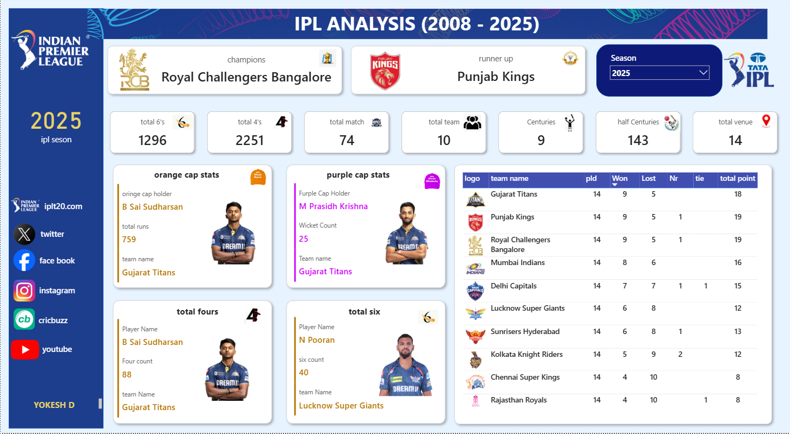

✨⭐ IPL Analysis Dashboard ⭐✨  
PowerBI | IPL | Cricket Analytics | Data Visualization  

  

An interactive Power BI dashboard analyzing 17 seasons of the Indian Premier League  
🏏 From 2008 to 2025 | Featuring Team Performance, Player Stats, and Season Highlights  

---

🏆 2025 Season Summary  
Champion: 🟥 Royal Challengers Bangalore  
Runner-up: 🟥 Punjab Kings  

📌 Tournament Stats  
| Metric | Value |
|--------|-------|
| 💥 Total Sixes | 1296 |
| 🔥 Total Fours | 2251 |
| 🎯 Matches | 74 |
| 👥 Teams | 10 |
| 💯 Centuries | 9 |
| 🎯 Half Centuries | 143 |
| 📍 Venues | 14 |

---

🏅 Star Performers – 2025  
| Award | Player | Stat | Team |
|-------|--------|------|------|
| 🟧 Orange Cap | B Sai Sudharsan | 759 runs | Gujarat Titans |
| 🟪 Purple Cap | M Prasidh Krishna | 25 wickets | Gujarat Titans |
| 🎯 Most Fours | B Sai Sudharsan | 88 fours | Gujarat Titans |
| 💥 Most Sixes | N Pooran | 40 sixes | Lucknow Super Giants |

---

📊 Points Table – 2025  
| Rank | Team | Pld | Won | Lost | NR | Tie | Points |
|------|------|-----|-----|------|----|-----|--------|
| 1 | Gujarat Titans | 14 | 9 | 5 | - | - | 18 |
| 2 | Punjab Kings | 14 | 9 | 5 | 1 | - | 19 |
| 3 | Royal Challengers Bangalore | 14 | 9 | 5 | 1 | - | 19 |
| 4 | Mumbai Indians | 14 | 8 | 6 | - | - | 16 |
| 5 | Delhi Capitals | 14 | 7 | 7 | 1 | 1 | 15 |
| 6 | Lucknow Super Giants | 14 | 6 | 8 | - | - | 12 |
| 7 | Sunrisers Hyderabad | 14 | 6 | 8 | 1 | - | 13 |
| 8 | Kolkata Knight Riders | 14 | 5 | 9 | 2 | - | 12 |
| 9 | Chennai Super Kings | 14 | 4 | 10 | - | - | 8 |
| 10 | Rajasthan Royals | 14 | 4 | 10 | 1 | - | 8 |

---

🛠️ Tools & Tech  
- Power BI – Dashboard creation & visualization  
- DAX – Calculations and measures  
- IPL Dataset (2008–2025) – Official statistics  

---

🎯 How to Explore  
1. Select a season using the slicer on the dashboard.  
2. View key stats like total runs, sixes, fours, centuries, etc.  
3. Check Orange/Purple Cap winners and other awards.  
4. Compare team performances through the points table.  

---

📸 Dashboard Sneak Peek  

  

---

📬 Author  
👤 Yokesh D  
📧 yokesh1507@gmail.com  
